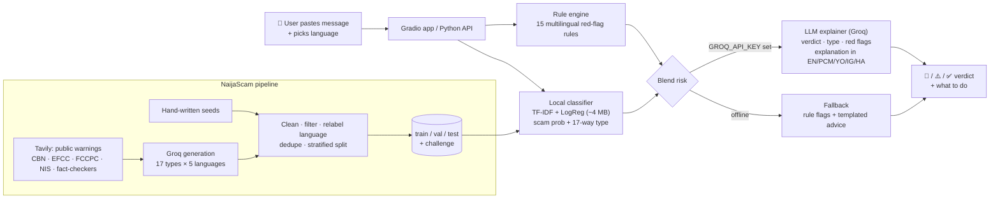

<div align="center">

# 🛡️ Shora (Ṣọ́ra)

### *"Ṣọ́ra" means "be careful" in Yorùbá.*
**An open-source AI scam shield for Nigerians, in English, Naija Pidgin, Yorùbá, Igbo and Hausa.**

[](https://github.com/kpealeakara-rgb/shora/actions/workflows/tests.yml)
[](LICENSE)


Paste a suspicious SMS, WhatsApp message or email. Get a **verdict**, the **scam type**, the **red flags**, and a
**plain explanation in your own language**, plus what to do next.

</div>

---

## Why this exists

Scams are now one of the biggest everyday risks for Nigerians:

- **1 in 5 Nigerians** lost money or data to scams, and 84% of adults surveyed had been exposed to one
  (GASA *State of Scams in Nigeria 2026*, reported by Microsoft/BusinessDay, Aug 2026).¹
- **₦25.85 billion** was lost to digital payment fraud in 2025. Social engineering is the most common technique,
  and **Lagos accounts for 63%** of fraud activity (NIBSS, Jan 2026).²
- The **CBEX** "AI trading" Ponzi collapse cost Nigerians about **₦1.3 trillion** (~$847m), according to the Senate
  probe and EFCC reporting.³
- The **SEC** estimates Nigerians have lost about **₦316 billion** to Ponzi schemes and illegal fund managers over
  the years, and that figure does not include CBEX (Oct 2025).⁴

Open tools haven't kept up. The Nigerian scam-detection repos on GitHub are small or stalled, and until now there was
**no public Nigerian scam dataset on Hugging Face**. Most scam detectors also only understand English, which leaves
out the Pidgin, Yorùbá, Igbo and Hausa messages that real scammers send.

**Shora's edge:** an open dataset (**NaijaScam**), a public benchmark (**NaijaScamBench**), a tiny model that runs
anywhere, and explanations people can actually read, in five Nigerian languages.

## What's inside (v0.1)

| | |
|---|---|
| 📚 **NaijaScam v0.1** | 1,821 labelled messages (982 scam / 839 legit) · 5 languages · 9 scam types + 8 look-alike legit types · red-flag annotations · held-out test split + 40-message hand-written challenge set |
| 📏 **NaijaScamBench** | Accuracy, macro-F1 and per-language F1 for rules, TF-IDF + LogReg, a fine-tuned African transformer, and a zero-shot LLM |
| ⚡ **Local classifier** | TF-IDF (word + char n-grams) + logistic regression · ~4 MB · < 1 ms per message on CPU · 17-way scam-type head |
| 🗣️ **Explainer** | Groq-hosted LLM writes the verdict and advice in EN / PCM / YO / IG / HA; falls back to offline rule-based red flags |
| 🖥️ **Gradio app** | Hugging Face Space-ready (`app/`) |

### Scam types covered

| | Scam type | Typical message |
|---|---|---|
| 💸 | Fake credit alert / overpayment | *"I don send the N85,000, na network delay. Release the goods sharp sharp."* |
| 🏦 | Bank / BVN / NIN impersonation & OTP theft | *"Your BVN has been restricted by CBN. Read the code we sent to reactivate."* |
| 📶 | SIM-swap pretext | *"Upgrade to 5G SIM: give our agent your PUK code."* |
| 📈 | Ponzi / crypto "AI trading" (CBEX-style) | *"AI arbitrage robot pays 5% daily. Withdrawal opens after 10% tax."* |
| 📱 | Loan-app harassment & extortion | *"Pay today or we send your photo to all your contacts as FRAUDSTER."* |
| 💼 | Fake job / visa / scholarship | *"Shortlisted for NNPC trainee. Pay N15,000 for medicals to Mr Bello."* |
| 💔 | Romance / "yahoo" | *"My love, your package is stuck at Lagos customs. Pay clearance."* |
| 🛒 | Fake vendor / delivery / POS | *"Pay N1,050 redelivery fee: konga-redeliver.top"* |
| 🎁 | Giveaway / fake government grant | *"FG is giving N250,000 to every Nigerian. Share to 10 groups to claim."* |

## Results: NaijaScamBench v0.1

| Model | Test acc. | Test macro-F1 | EN | PCM | YO | IG | HA | Challenge acc. | Challenge **scam recall** |
|---|---:|---:|---:|---:|---:|---:|---:|---:|---:|
| Rules only (regex red flags) | 72.0 | 72.0 | 72.6 | 71.0 | 72.1 | 77.5 | 65.7 | 60.0 | – |
| **TF-IDF + LogReg** (shipped) | **97.8** | **97.8** | 95.9 | 97.9 | 100 | 100 | 100 | **75.0** | 50% |
| afro-xlmr-mini fine-tuned (CPU, 8.7 min) | 94.2 | 94.2 | 93.3 | 95.7 | 87.7 | 100 | 95.1 | 67.5 | 35% |
| gpt-oss-120b zero-shot (Groq) | partial† | | | | | | | | **95%** |

Test = 365 held-out synthetic messages. Challenge = 40 hand-written, out-of-distribution messages (20 scam / 20 legit).
Per-language columns are test macro-F1. † The Groq free-tier daily token quota ran out while scoring: the LLM got
70/70 of the scored test messages and 19 of the 20 challenge scams. Full table: [`benchmark/RESULTS.md`](benchmark/RESULTS.md).

**What this tells us, honestly:** small models are excellent on in-distribution synthetic data but **miss half of the
short, conversational scams** a human writes, especially in Igbo and Hausa. That's why Shora uses the local model
as a fast first pass and an LLM for the final verdict, and why **real, anonymised messages from you** are the most
valuable contribution right now.

## Architecture



## Quickstart

```bash
git clone https://github.com/kpealeakara-rgb/shora && cd shora
pip install -r requirements.txt            # scikit-learn, numpy, joblib, requests
python scripts/train_baseline.py           # ~20 s on CPU, writes models/tfidf-logreg
```

```python
import sys; sys.path.insert(0, "src")
from shora import analyze

r = analyze("Oga I don send the N85,000. Na network delay, e go reflect. Release the goods.", language="pcm")
print(r["verdict"], r["scam_type"], r["red_flags"], r["explanation"], r["what_to_do"], sep="\n")
```

Set `GROQ_API_KEY` to get LLM explanations in the chosen language; without it Shora runs fully offline.

**Run the app**

```bash
pip install -r app/requirements.txt
python app/app.py                          # http://127.0.0.1:7860
```

**Reproduce everything**

```bash
python scripts/generate_dataset.py --budget 90   # resumable; needs GROQ_API_KEY (repeat until 0 jobs remain)
python scripts/build_dataset.py --merge          # clean, filter, dedupe, split -> data/naijascam/
python data/challenge/make_challenge.py          # 40 hand-written challenge messages
python scripts/train_baseline.py                 # rules + TF-IDF baselines
pip install -r requirements-train.txt
python scripts/finetune_transformer.py --budget 90   # resumable CPU fine-tune of afro-xlmr-mini; repeat until done
python scripts/finetune_transformer.py --evaluate
python scripts/eval_llm.py --split test          # zero-shot LLM (resumable, batched)
python scripts/make_results_table.py             # -> benchmark/RESULTS.md
pytest -q
```

## Repository layout

```
shora/
├── app/                    Gradio app (Hugging Face Space-ready: app.py, requirements.txt, README.md)
├── benchmark/              NaijaScamBench results (RESULTS.md + per-model JSON & predictions)
├── data/
│   ├── naijascam/          train/validation/test.jsonl, test.csv, challenge.jsonl, dataset card
│   ├── raw/                raw generator output (pre-filter)
│   ├── seeds/              hand-written seeds + Tavily grounding sources
│   └── challenge/          script that writes the hand-written challenge set
├── models/tfidf-logreg/    shipped baseline (~4 MB)
├── scripts/                generate · build · train · fine-tune · evaluate · prepare_space
├── src/shora/              taxonomy · rules · classifier · analyze · llm · benchmark
└── tests/                  pytest suite (runs in GitHub Actions)
```

## Roadmap

- [ ] 🖼️ **Screenshot fake-alert checker**: OCR + layout checks for edited bank-alert and transfer screenshots
- [ ] 📞 **Call / voice-note checker**: transcribe with Whisper, then run the same analysis
- [ ] 📊 **Investment check**: look up a platform against SEC Nigeria's public notices and registered operators (via Tavily search)
- [ ] 💬 **WhatsApp bot**: forward a message, get a verdict back in your language
- [ ] 📦 **On-device model**: distilled GGUF / ONNX build for Android and feature phones (offline)
- [ ] 🧑🏾‍🤝‍🧑🏾 **NaijaScam v0.2 with real data**: community-submitted, PII-scrubbed messages + native-speaker review for YO/IG/HA
- [ ] 🔁 Monthly refresh with new scam patterns (new grant names, new "AI trading" brands)
- [ ] 🧪 Full LLM leaderboard on NaijaScamBench (more open models)

## Contributing

The most useful thing you can do is **send us real scam messages with personal details removed**, or review the
Yorùbá, Igbo, Hausa and Pidgin text. See [CONTRIBUTING.md](CONTRIBUTING.md).

## Safety note

Shora gives advice, not guarantees. It can be wrong. Before acting, confirm through your bank's official app or
the number on the back of your card. Never share your PIN, OTP, BVN or password, and never paste them into any
website, including this one. Report fraud to your bank, the **EFCC** (efcc.gov.ng), the **FCCPC** for loan-app abuse,
and the **NCC** for telecom fraud.

## Sources

1. BusinessDay, "One in five Nigerians lost money or data to scams as trust crisis deepens, says Microsoft" (5 Aug 2026), https://businessday.ng/technology/article/one-in-five-nigerians-lost-money-or-data-to-scams-as-trust-crisis-deepens-says-microsoft; GASA, *State of Scams in Nigeria 2026*, https://gasa.org/knowledge-base/reports/state-of-scams-in-nigeria-2026
2. NIBSS, "Digital payment fraud drops 51% to N25.85b, Lagos accounts for 63%" (22 Jan 2026), https://nibss-plc.com.ng/digital-payment-fraud-drops-51-to-n25-85b-lagos-accounts-for-63
3. Premium Times, "Senate probes Ponzi schemes in Nigeria, loss of N1.3trn by Nigerians to CBEX", https://www.premiumtimesng.com/business/business-news/806149-senate-probes-ponzi-schemes-in-nigeria-loss-of-n1-3trn-by-nigerians-to-cbex.html; Punch, https://punchng.com/senate-probes-n1-3tn-cbex-collapse-declares-national-emergency
4. Punch, "Investors lost N316bn to ponzi schemes in Nigeria – SEC" (30 Oct 2025), https://punchng.com/investors-lost-n316bn-to-ponzi-schemes-in-nigeria-sec/

## Licence & citation

Code: MIT. Dataset: CC BY 4.0. If you use NaijaScam or NaijaScamBench, please cite:

```bibtex
@misc{kpeale2026shora,
  title  = {Shora: An Open Multilingual Scam Shield and the NaijaScam Benchmark for Nigeria},
  author = {Kpeale, Akara},
  year   = {2026},
  url    = {https://github.com/kpealeakara-rgb/shora}
}
```

<div align="center"><b>Ṣọ́ra · Kpachara anya · Ka yi hankali · Shine your eye.</b> 🇳🇬</div>
